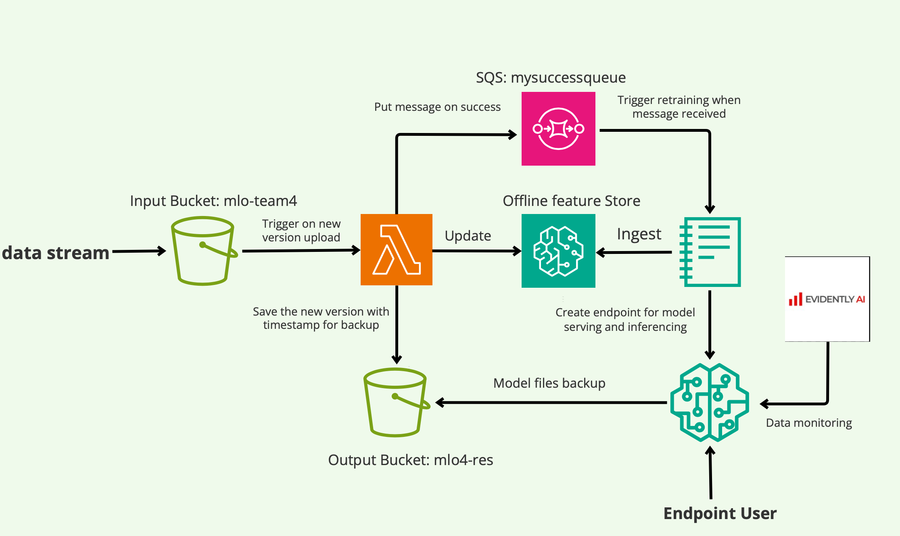

# Housing price perdiction on Seattle, WA
an automated, ever-evolving machine learning pipeline powered by AWS Sagemaker + H2O
 
* continuous data ingestion on upload (data versioning)
* retrain automl pipeline when feature store updates
* monitor data quality & drift with evidently.ai -> https://www.evidentlyai.com
* model deployed on AWS sagemaker for quick inference (endpoint user)
* Step-wise backup on result bucket ready for fallback in case error 


## model pipeline



## directory
<pre>
```
├── LICENSE
├── README.md
├── code
│   ├── auto_ML.py --> auto_ml pipeline in python
│   ├── auto_ml.ipynb --> auto_ml pipepline in jupyter notebook
│   ├── feature-store.ipynb --> feature store building logic
│   ├── lambda_function.py --> lambda function that save message to sqs which further triggers auto_ml pipeline
│   └── test_sqs.py --> sqs trigger with automl pipeline
├── data
│   └── housing_data_original.csv
├── features - **offline feature store logic
│   ├── simulation
│   │   └── 637423203755
│   │       └── sagemaker
│   │           └── us-east-2
│   │               └── offline-store
│   │                   └── housing-feature-group-simulation-1733973023
│   │                       ├── data
│   │                       │   └── year=2024
│   │                       │       └── month=12
│   │                       │           └── day=12
│   │                       │               └── hour=02
│   │                       │                   ├── 20241212T025413Z_15977ErWuTeSkLTo.parquet
│   │                       │                   ├── 20241212T025413Z_2H81IzSQl3st5Cwl.parquet
│   │                       │                   ├── 20241212T025413Z_3h3w6JjzbMbvh8SO.parquet
│   │                       │                   ├── 20241212T025413Z_3nmJfsAY3W99SN15.parquet
│   │                       │                   ├── 20241212T025413Z_4ZQgye1QyQaxAX3l.parquet
│   │                       │                   ├── 20241212T025413Z_5MViwspLMpLF6mAJ.parquet
│   │                       │                   ├── 20241212T025413Z_6oiGWWx40c3oA7bK.parquet
│   │                       │                   ├── 20241212T025413Z_7YzeMFKkvInOU7qH.parquet
│   │                       │                   ├── 20241212T025413Z_8fd3C5XNwMMIDXyB.parquet
│   │                       │                   ├── 20241212T025413Z_9rlGZ7qrlkHAMYBk.parquet
│   │                       │                   ├── 20241212T025413Z_BtyYewBzAb1Ltdmn.parquet
│   │                       │                   ├── 20241212T025413Z_DyEA6IjRzq8WGARa.parquet
│   │                       │                   ├── 20241212T025413Z_E6hR9BfpoGY1TpP9.parquet
│   │                       │                   ├── 20241212T025413Z_EA9T7Nt0nyjlfM9r.parquet
│   │                       │                   ├── 20241212T025413Z_EXNKLmVEcEersIYg.parquet
│   │                       │                   ├── 20241212T025413Z_GQAnYql8rcccKNQJ.parquet
│   │                       │                   ├── 20241212T025413Z_HpMniTDRUZ1M3Y08.parquet
│   │                       │                   ├── 20241212T025413Z_HsXe5Hc4MLi9dxuw.parquet
│   │                       │                   ├── 20241212T025413Z_NfPDy0F130PwZXYq.parquet
│   │                       │                   ├── 20241212T025413Z_NzzdUJj4Uzk26tHQ.parquet
│   │                       │                   ├── 20241212T025413Z_O8X1IcXORTAVBKsz.parquet
│   │                       │                   ├── 20241212T025413Z_PlyiGTsJwk1gAGOC.parquet
│   │                       │                   ├── 20241212T025413Z_QPjFA2qIuPNnJ4wQ.parquet
│   │                       │                   ├── 20241212T025413Z_QRdQiRtPQgBLGIvl.parquet
│   │                       │                   ├── 20241212T025413Z_QeiAnNFn4fbSddg0.parquet
│   │                       │                   ├── 20241212T025413Z_SV0Js8dFfjFLsXHg.parquet
│   │                       │                   ├── 20241212T025413Z_TFsn5B5ms79njeog.parquet
│   │                       │                   ├── 20241212T025413Z_TPiy0NR1GT19YOeL.parquet
│   │                       │                   ├── 20241212T025413Z_VOxtzIRHMnt2fI9E.parquet
│   │                       │                   ├── 20241212T025413Z_X018Y4jPBzmHMF0Y.parquet
│   │                       │                   ├── 20241212T025413Z_fISnFeQT0YUQPZxS.parquet
│   │                       │                   ├── 20241212T025413Z_iipCdCOg14oHHul5.parquet
│   │                       │                   ├── 20241212T025413Z_kj4ynMcjqxIIvKH9.parquet
│   │                       │                   ├── 20241212T025413Z_l1y9bIreoXB5366G.parquet
│   │                       │                   ├── 20241212T025413Z_oim1O7iCXx7watlE.parquet
│   │                       │                   ├── 20241212T025413Z_otnvOeO2h0ivYAH8.parquet
│   │                       │                   ├── 20241212T025413Z_ow0ayswFjI3vNEVz.parquet
│   │                       │                   ├── 20241212T025413Z_q0c52S44owBwM1Xy.parquet
│   │                       │                   ├── 20241212T025413Z_shsDKFE1HXs9cjqQ.parquet
│   │                       │                   ├── 20241212T025413Z_tp9TB6dsWBG3vP2Y.parquet
│   │                       │                   ├── 20241212T025413Z_uqKHbP0tQzZLmqLg.parquet
│   │                       │                   └── 20241212T025413Z_y7r7BVbjBAE3GAUc.parquet
│   │                       └── housing-feature-group-simulation2024-12-12T03:10:23.881Z.txt
│   └── test
│       └── 637423203755
│           └── sagemaker
│               └── us-east-2
│                   └── offline-store
│                       └── housing-feature-group-test-1733972554
│                           ├── data
│                           │   └── year=2024
│                           │       └── month=12
│                           │           └── day=12
│                           │               └── hour=02
│                           │                   ├── 20241212T025413Z_0dFrA3glgB4lRhMm.parquet
│                           │                   ├── 20241212T025413Z_2vIQ297MeNSbIlHQ.parquet
│                           │                   ├── 20241212T025413Z_6OL0Ej0ZQF3G08nW.parquet
│                           │                   ├── 20241212T025413Z_AsD8g3Vdc4x0YHwC.parquet
│                           │                   ├── 20241212T025413Z_EGHRYHpAxuZfjyf2.parquet
│                           │                   ├── 20241212T025413Z_OfsHahIvTRCTNflQ.parquet
│                           │                   ├── 20241212T025413Z_S3saNjUh5pQPcuXo.parquet
│                           │                   ├── 20241212T025413Z_TBa8zmp0IKvaEJNz.parquet
│                           │                   ├── 20241212T025413Z_c4BkpJELENvAqEK3.parquet
│                           │                   ├── 20241212T025413Z_jl0OSTz203SVcTb4.parquet
│                           │                   ├── 20241212T025413Z_nosTaxvri6OP8ov6.parquet
│                           │                   ├── 20241212T025413Z_sgMPRO0SW0nI4tXm.parquet
│                           │                   ├── 20241212T025413Z_vfZVeOGIzhGPCcgt.parquet
│                           │                   └── 20241212T025413Z_yAsO6K3WSwPhSqpx.parquet
│                           └── housing-feature-group-test2024-12-12T03:02:34.509Z.txt
├── lambda_setup.png
├── model
│   └── h2o_best_model.tar
├── pipline_architecture.png
├── report
│   ├── monitoring_report_simu1.html
│   ├── monitoring_report_simu1_simu2.html
│   └── monitoring_report_simu3poisoned.html
└── sqs_setup.png
```
</pre>
